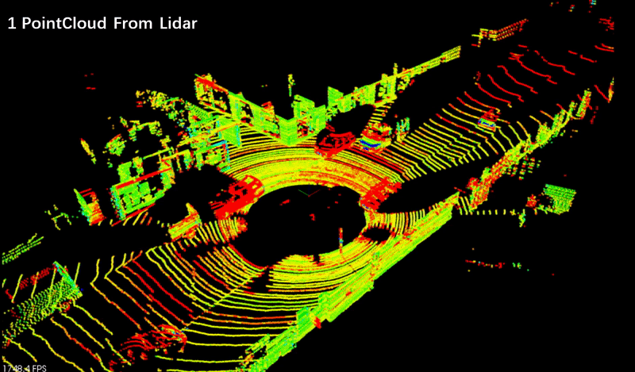

# Sensor Fusion Self-Driving Car Course


### Lidar Obstacle Detection for self-driving cars.

In this Project I developed an obstacle detection system utilizing Kitti point cloud data, 
integrating RANSAC, Euclidean clustering, and KD-Trees algorithms with the Point Cloud Library (PCL). 
This project utilizes geometric techniques to accurately detect obstacles, enhancing perception capabilities
in autonomous systems. The implementation underscores proficiency in algorithmic design, simulation, and 
library integration, contributing to the development of robust autonomous perception solutions.




**Note** This project was done on WSL Ubuntu Bionic 18.04

## Local Installation

### Ubuntu 

1. Clone this github repo:

   ```sh
   cd ~
   git clone https://github.com/udacity/SFND_Lidar_Obstacle_Detection.git
   ```

3. Execute the following commands in a terminal

   ```shell
   sudo apt install libpcl-dev
   cd ~/SFND_Lidar_Obstacle_Detection
   mkdir build && cd build
   cmake ..
   make
   ./environment
   ```


You can either build PCL from source (for v1.11) or use the older version.

### MAC

#### Install via Homebrew
1. install [homebrew](https://brew.sh/)
2. update homebrew 
	```bash
	$> brew update
	```
3. add  homebrew science [tap](https://docs.brew.sh/Taps) 
	```bash
	$> brew tap brewsci/science
	```
4. view pcl install options
	```bash
	$> brew options pcl
	```
5. install PCL 
	```bash
	$> brew install pcl
	```

6. Clone this github repo

   ```shell
   cd ~
   git clone https://github.com/udacity/SFND_Lidar_Obstacle_Detection.git
   ```

7. Edit the CMakeLists.txt file as shown in Step 2 of Ubuntu installation instructions above.

8. Execute the following commands in a terminal

   ```shell
   cd ~/SFND_Lidar_Obstacle_Detection
   mkdir build && cd build
   cmake ..
   make
   ./environment
   ```
If you get build errors related to Qt5, make sure that the path for Qt5 is correctly set in .bash_profile or .zsh_profile (Refer [#45](https://github.com/udacity/SFND_Lidar_Obstacle_Detection/issues/45))

### WINDOWS

#### Install via cvpkg

1. Follow the steps [here](https://pointclouds.org/downloads/) to install PCL.

2. Clone this github repo

   ```shell
   cd ~
   git clone https://github.com/udacity/SFND_Lidar_Obstacle_Detection.git
   ```

3. Edit the CMakeLists.txt file as shown in Step 2 of Ubuntu installation instructions above.

4. Execute the following commands in Powershell or Terminal

   ```shell
   cd ~/SFND_Lidar_Obstacle_Detection
   mkdir build && cd build
   cmake ..
   make
   ./environment
   ```

### Acknowledgments

The gif for obstacle detection steps is borrowed from [this repo](https://github.com/lilyhappily/SFND-P1-Lidar-Obstacle-Detection)

#### Build from Source

[PCL Source Github](https://github.com/PointCloudLibrary/pcl)

[PCL Mac Compilation Docs](https://pcl.readthedocs.io/projects/tutorials/en/latest/compiling_pcl_macosx.html#compiling-pcl-macosx)
